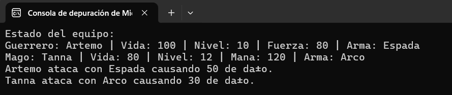
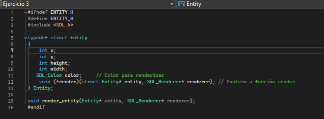
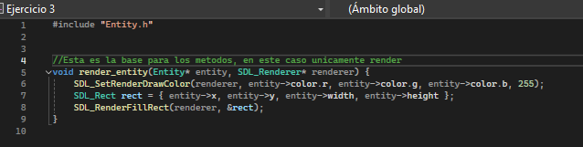

[](https://classroom.github.com/a/-g_ni1Wx)
# Documentación del Proyecto
## Unidad 3

Estudiante:Luciana Gutiérrez Posada  
Id: 000507574
---

# Principios de POO
En este documento haré un registro de lo que comprendi y realice en cada uno de los principios fundamentales de POO, para asi evidenciar mi proceso con esta parte de la unidad 3 y al final responder las preguntas

## Abstracción 

- La parte conceptual la comprendi con facilidad, se trata de crear estructuras que representan los objetos junto con sus funciones, las clases en C se organixan con archivos .h y .c, ambos se necesitan mutuamente para poder funcionar

En el ejemplo creamos un personaje con ambos archivos, donde en el .h definimos una estructura con los atributos/propiedades de vida, nombre y nivel, y una funcion para mostrar el estado del personaje. 
Mas abajo tenemos una linea donde a Personaje se le pone un puntero en personaje crear y en el .c es donde le asignamos valores a los atributos. En el archivo .c definimos el nombre, vida y nivel del personaje con otra funcion
Luego con el fragmento anterior de crear personaje hacemos una nueva parte donde dice nuevo_personaje, que alli se almacena la info del personaje que creamos.
La parte de Personaje_destruir es para liberar la memoria dinamica. 
Me parecio importante evidenciar lo que entendi acerca del ejemplo puesto la mayoria de funciones o logica las usaremos mas adelante, a partir de aca solo evidenciare lo conceptual y las actividades practicas.

- Actividad práctica: 
**Crea una clase llamada Arma que tenga atributos como nombre, daño y alcance, y una función mostrar_info que imprima los detalles del arma. Implementa las funciones para crear y destruir un Arma.**

Arma.h 
```C
#ifndef ARMA_H
#define ARMA_H

typedef struct Arma {
    char* nombre;
    int daño;
    int alcance;
    void (*mostrar_info)(const struct Arma* this);
} Arma;

Arma* Arma_crear(const char* nombre, int daño, int alcance); //Función para crear arma
void Arma_destruir(Arma* this);// Funcion para destuir arma

#endif // ARMA_H

```
Aqui utilice el ejemplo como referencia, cree una estructura, cambie los atributos a los que se nos pedian en el ejemplo y la funcion, que la parte de imprimir los detalles la puse en el .c 

Arma.c
```C
#include "Arma.h"
#include <stdio.h>
#include <stdlib.h>
#include <string.h>

static void mostrar_info_impl(const Arma* this) {
    printf("Arma: %s | Daño: %d | Alcance: %d\n", this->nombre, this->daño, this->alcance);
}

Arma* Arma_crear(const char* nombre, int daño, int alcance) { //Funcion de crear arma
    Arma* nueva_arma = (Arma*)malloc(sizeof(Arma));
    if (!nueva_arma) return NULL;
    nueva_arma->nombre = (char*)malloc(strlen(nombre) + 1);
    strcpy_s(nueva_arma->nombre, strlen(nombre) + 1, nombre);
    nueva_arma->daño = daño;
    nueva_arma->alcance = alcance;
    nueva_arma->mostrar_info = mostrar_info_impl;
    return nueva_arma;
}

void Arma_destruir(Arma* this) {//funcion de destuir arma
    if (this) {
        free(this->nombre);
        free(this);
    }
}

```
Acá tambien me base en el codigo del ejemplo, cambie la parte de los atributos y la del nombre, puesto que la funcion strdup no funcionaba, inicialmente use solo strcpy_s pero, me toco cambiarlo con la ayuda de chat porque a medida que avanzaba en los otros temas la funcion perdio funcionalidad y sacaba error al compilar, y mas adelante llego a sacar problema al momento de ejcutar, pero no de compilar. 
La explicacion que me dio fue esta:  La razón por la que no puedes usar solo strcpy_s sin el tamaño de destino es porque strcpy_s es una función de copia de cadenas que incluye una verificación de seguridad. Esta función necesita que le pases el tamaño del buffer de destino para evitar desbordamientos de búfer, que podrían causar fallos de seguridad o errores en el programa.

## Encapsulamiento 
- En lo conceptual de esta parte entendi que se ocultan partes de una clase y solo se deja abierto lo que se necesita, para facilitar el mantenimiento y proteger los datos, en C se ponen las declaraciones en los .h y las definiciones en los .c, se usa el modificador static en los atchivos .c para limitar el alcance a ese archivo, impidiendo su acceso desde otros, solo se puede ver y usar donde se declaro la variable o funcion que lleva static. 

- Actividad práctica: 
**Refactoriza el código de Arma que creaste anteriormente para que las funciones internas o variables auxiliares sean static y no estén expuestas en el archivo de cabecera.**

Arma.c 
```C
static void mostrar_info_impl(const Arma* this) {
    printf("Arma: %s | Daño: %d | Alcance: %d\n", this->nombre, this->daño, this->alcance);
}
```
Primero fui a Arma.h y verifique que la unica funcion o variable que no se usa del .c en el .h es la de mostrar_info_impl, por lo cual me dirigi al .c y encapsule esta funcion puesto que solo se usa en este archivo

## Herencia 
- La herencia no es directamente soportada por C, pero se explica que esto se puede simular incluyendo una estructura dentro de otra, porque la herencia en si se trata de crear clases nuevas basandose en clases existentes. 

En el ejemplo se escribio "Personaje base;" para copiar la estructura de personaje, pero se agrego un int fuerza, por lo cual la funcion mostrat_estado_impl se debe de reescribir para mostrar la fuerza.

- Actividad Práctica: 

**Crea una estructura Mago que herede de Personaje y sobreescriba la función mostrar_estado para incluir un atributo específico como mana. Implementa las funciones necesarias para crear y destruir un Mago.**
Mago.h
```C
#ifndef MAGO_H
#define MAGO_H

#include "Personaje.h"

typedef struct Mago {
    Personaje base;
    int mana;

} Mago;

Mago* Mago_crear(const char* nombre, int vida, int nivel, int mana, Arma* arma);
void Mago_destruir(Mago* this);

#endif // MAGO_H
```
Incluyo el archivo personaje.h para poder aplicar la herencia, creo la estructura y uso Personaje base; para clonar los metodos y atributos de la clase personaje, pongo el int mana extra puesto que no esta incluido en personaje.

Mago.C
```C
#include "Mago.h"
#include <stdlib.h>
#include <string.h>

static void mostrar_estado_impl(const Personaje* this) {
    Mago* mago = (Mago*)this;
    printf("Mago: %s | Vida: %d | Nivel: %d | Mana: %d | Arma: %s\n", this->nombre, this->vida, this->nivel, mago->mana, this->arma->nombre);
}

Mago* Mago_crear(const char* nombre, int vida, int nivel, int mana, Arma* arma) {
    Mago* nuevo_mago = (Mago*)malloc(sizeof(Mago));
    if (!nuevo_mago) return NULL;
    nuevo_mago->base.nombre = (char*)malloc(strlen(nombre) + 1);
    strcpy_s(nuevo_mago->base.nombre, strlen(nombre) + 1, nombre);
    nuevo_mago->base.vida = vida;
    nuevo_mago->base.nivel = nivel;
    nuevo_mago->base.arma = arma;
    nuevo_mago->base.mostrar_estado = mostrar_estado_impl;
    nuevo_mago->base.atacar = atacar_impl;
    nuevo_mago->mana = mana;
    return nuevo_mago;
}

void Mago_destruir(Mago* this) {
    if (this) {
        free(this->base.nombre);
        free(this);
    }
}

```
En el archivo .c cree la funcion de crear mago y destruirlo, cambie la funcion mostrar estado para que tenga el mana, en crear personaje uso base.nombre por la herencia de personaje.
## Polimorfismo

- El polimorfismo en si permite que varias clases se puedan tratar como instancias de una clase base, y que las funciones que se llaman se comporten de distintas maneras dependiendo de la clase REAL del objeto, para lograr esto en C se usan punteros a la clase base y a funciones. 

- Actividad practica: 
**Añade una función atacar a Personaje y sobreescríbela en Guerrero y Mago para que impriman mensajes específicos. Luego, recorre el arreglo de Personaje* y llama a atacar para cada uno.**

1. Añadí la funcion atacar a personaje.c
```C
static void atacar_impl(const Personaje* this) {
    printf("%s ataca con %s causando %d de daño.\n", this->nombre, this->arma->nombre, this->arma->daño);
}
```
2. Agregue las funcuones en Guerrero y mago y las sobreescribi con punteros a cada clase
```c
static void atacar_impl(const Personaje* this) {
    Guerrero* guerrero = (Guerrero*)this;
    printf("%s ataca con %s causando %d de daño.\n", this->nombre, this->arma->nombre, this->arma->daño);
}
```
```C
static void atacar_impl(const Personaje* this) {
    Mago* mago = (Mago*)this;
    printf("%s ataca con %s causando %d de daño.\n", this->nombre, this->arma->nombre, this->arma->daño);
}
```
3. La parte de recorrer el arreglo Personaje* y llamar atacar a cada clase la hice en el main, pero la tengo con equipo que es lo que implemento en agregacion 
```C
for (int i = 0; i < equipo->cantidad_personajes; ++i) {
    equipo->personajes[i]->atacar(equipo->personajes[i]);
}
```
### Agregación
Es una forma de asociacion donde una clase es dueña de las instancias de otra.
- Actividad práctica: 
**Implementa una estructura Equipo que agregue varios objetos tipo Personaje y tenga una función para mostrar el estado de todo el equipo. Asegúrate de liberar la memoria correctamente.**
Primero cree el archivo equipo.h con puntero de personaje a personajes y un int para la cantidad de personajes, tiene sus respectivas funciones para crear, destruir, agregar personaje y mstrar el estado que tiene todo el equipo como se nos propiedades
```c
#ifndef EQUIPO_H
#define EQUIPO_H

#include "Personaje.h"

typedef struct Equipo {
    Personaje** personajes;
    int cantidad_personajes;
} Equipo;

Equipo* Equipo_crear();
void Equipo_agregar_personaje(Equipo* this, Personaje* personaje);
void Equipo_mostrar_estado(const Equipo* this);
void Equipo_destruir(Equipo* this);

#endif // EQUIPO_H
```
En el archivo equipo.c para la funcion agregar personaje hice que al llamarla sume 1 a la cantidad de personajes, cree un arreglo nuevo, el realloc redimensiona el arreglo.
En mostrar equipo, muestra el estado y agarra la cantidad de personajes para saber cuantas veces tiene que recorrer el arreglo, y en cada vez agarra el personaje registrado y su respectiva funcion de mostrar estado
```c
#include "Equipo.h"
#include <stdio.h>
#include <stdlib.h>

Equipo* Equipo_crear() {
    Equipo* nuevo_equipo = (Equipo*)malloc(sizeof(Equipo));
    if (!nuevo_equipo) return NULL;
    nuevo_equipo->personajes = NULL;
    nuevo_equipo->cantidad_personajes = 0;
    return nuevo_equipo;
}

void Equipo_agregar_personaje(Equipo* this, Personaje* personaje) {
    Personaje** nuevo_array = realloc(this->personajes, sizeof(Personaje*) * (this->cantidad_personajes + 1));
    if (nuevo_array) {
        this->personajes = nuevo_array;
        this->personajes[this->cantidad_personajes++] = personaje;
    }
}

void Equipo_mostrar_estado(const Equipo* this) {
    printf("Estado del equipo:\n");
    for (int i = 0; i < this->cantidad_personajes; ++i) {
        this->personajes[i]->mostrar_estado(this->personajes[i]);
    }
}

void Equipo_destruir(Equipo* this) {
    if (this) {
        free(this->personajes); // Solo liberar el array de punteros
        free(this);
    }
}
```
En el main queda asi: 
```C
 // Crear equipo y agregar personajes
 Equipo* equipo = Equipo_crear();
 Equipo_agregar_personaje(equipo, (Personaje*)guerrero);
 Equipo_agregar_personaje(equipo, (Personaje*)mago);

 // Mostrar estado del equipo
 Equipo_mostrar_estado(equipo);

 // Llamar a atacar para cada personaje en el equipo
 for (int i = 0; i < equipo->cantidad_personajes; ++i) {
     equipo->personajes[i]->atacar(equipo->personajes[i]);
 }

 // Liberar memoria
 Equipo_destruir(equipo);

```

## Preguntas y discusion 

1. ¿Por qué, en este apartado, se afirma que la POO no es un lenguaje de programación? ¿Estás de acuerdo con esta apreciación?

La programacion orientada a objetos realmente para mi es una forma de estructurar y trabajar un codigo, dividiendolo por clases que se necesitan mutuamente para poder mantener la funcionalidad y logica del codigo, esto se expresa en la guia y estoy totalmente de acuerdo puesto que a mi parecer facilita la estructura y organizacion del codigo, lo hace eficaz y tiene mayor rendimiento en proyectos grandes. 

2. ¿Cuál va a ser la estrategia que vas a emplear para modificar tu código, incorporando los conceptos de la POO? Describe el paso a paso

- Definir clases con sus metodos y atributos
- Crear los archivos
- Crear un padre con los atributos y metodos en comun para hacer las estructuras
- Construir estructuras, empezar por crear los objetos, destruirlos y renderizarlos
- Verificar que se renderice  
- Empezar a agregar metodos para verificar colisiones
- Verificar que funcione
- Agregar movimiento a la paleta
- Incorporar puntaje 
- Plantear e implementar power ups

3. Deja tus conclusiones luego de esta actividad. ¿Qué aprendiste, qué sabías, pero pudiste profundizar? ¿Cuáles son los temas que aún te generan dudas?

Aprendí como implementar POO en C, se los fundamentos de POO pero pude profundizar y refrescar los temas de asociasion y agregacion, lo que me genera dudas es el encapsulamiento,y el uso de strings para los nombres, no logro entender porque es tan dificil y tedioso 

# Actividad 2

1. **Identificación de Clases:**
    - Analiza las entidades principales de tu juego (como personajes, objetos interactivos, entornos) e identifica las clases que representarían estas entidades.

    En este juego tenemos ladrillos, bola y paleta, las clases que creo que podria establecer serian: 

        - Bola 
        - Paleta
        - Ladrillos
        - Game (sería el main)
    - Define cuáles de estas clases serán *principales* (padres) y cuáles serán *derivadas* (hijas), siguiendo un enfoque de reutilización de código.

    Tendria una clase padre donde pondria los metodos de render y 
    atributos de posicion en X y Y, ancho y alto, puesto que las 3 figuras se conforman por rectangulos o cuadrados entonces comparten estos atributos, todavia no se si hacer una clase Entity o usar una anterior como las de los objetos. 
    Las clases derivadas serian bola, paleta y ladrillo

        - Bola: 
            
            Atributos:Además de los de la clase Entity
            int dx (velocidad en x)
            int dy (velocidad en y)
            int radio
            Métodos: 
            Update () (actuliza posicion y verifica colisiones)
            Verificar_colision_bola_paleta()

        - Paleta: 
            Atributos: Además de los de Entity
            int speed (velocidad de movimiento)
            Métodos:
            move () (mueve la paleta con la entrada de teclado)
          

        - Ladrillos: 
            Atributos: Los de Entity
            bool destroyed (marca si se destruyo el ladrillo)
            Métodos: 
            check_colission_bola_ladrillo () (verifica colision de la bola)
            process_input()

        Clase Game: 

        Métodos: initialize()

        Relaciones:
        
        Herencia: Ball, Paddle, y Brick heredan de Entity, lo que permite reutilizar los métodos y atributos comunes como move() y check_collision().

        Agregación: La clase Game administra las instancias de Ball, Paddle, y una lista o matriz de Brick.
# Diagrama UML: 
.jpeg>)

# Codigo de brick breaker a POO

Primero cree los archivos .h y .c de cada clase, como lo son entity, bola,ladrillo y paleta. 
De ahi empece con las estructuras y la herencia desde Entity, al hacer estoy vi que bola maneja radio, no ancho ni alto, entonces recorde que la bola de mi juego no es un circulo si no un cuadrado, entonces me di cuenta que podia cambiar radio por estos atributos y usar la herencia a la perfeccion. 

Primero cree el Entity


Ahi esta la estructura donde tenemos x, y, alto, ancho y el color para el render, que en cada clase hija se le asigna el color en rgb

Luego fui a bola, paleta y ladrillo. En bola agregue dx y dy que son las velocidades, en paleta la velocidad y en ladrillo el bool destruido.
Ya teniendo la estructura lista fui a cada archivo .c, cree la estructura para crear y destruir cada objeto, en ladrillo cree el arreglo directamente, agregue el render, con su respectivo color:
```C
void render_bola(Bola* bola, SDL_Renderer* renderer) {
	render_entity((Entity*)bola, renderer); // Llama a la función de renderizado de la entidad
}
```
Es igual para paleta, para ladrillo se condiciona con la destruccion del ladrillo.

Luego en el main verifique que se renderizaran bien, llamando cada render, en el main solo deje la inicializacion de SDL, actualizacion de pantalla y limpieza de recursos.
Tras verificar eso empece poco a poco, primero implemente la colision de ladrillo-> bola, en la cual tome el codigo original y lo transcribi:
En esta parte tuve un problema con la libreria para los datos booleanos que se soluciono con include en el archivo bola
Original: 
```C
void check_ball_brick_collision() {
    for (int i = 0; i < 5; i++) {
        for (int j = 0; j < 10; j++) {
            struct Brick* brick = &bricks[i][j];
            if (!brick->destroyed &&
                ball.x + ball.width >= brick->x &&
                ball.x <= brick->x + brick->width &&
                ball.y + ball.height >= brick->y &&
                ball.y <= brick->y + brick->height) {
                brick->destroyed = true; 
                ball.dy *= -1; 
                score += 10; 
                printf("Puntaje: %d\n", score); 
            }

        }
    }
}
```
Transcripcion: Tenia un debug pero lo quite, era para asegurarme de que ocurriera la colision asi no se renderizara
```C
void check_bola_brick_collision(Bola* bola, Ladrillo* ladrillos[5][10]) {
    for (int i = 0; i < 5; i++) {
        for (int j = 0; j < 10; j++) {
            Ladrillo* ladrillo = ladrillos[i][j]; // Cambia a puntero directo
            if (!ladrillo->destruido) {
                // Verificación de colisión entre la bola y el ladrillo
                if (bola->base.x < ladrillo->base.x + ladrillo->base.width &&
                    bola->base.x + bola->base.width > ladrillo->base.x &&
                    bola->base.y < ladrillo->base.y + ladrillo->base.height &&
                    bola->base.y + bola->base.height > ladrillo->base.y) {

                    // Si colisiona, destruimos el ladrillo y cambiamos la dirección de la bola
                    ladrillo->destruido = true;
                    bola->dy *= -1;  // Cambiamos la dirección vertical de la bola
                    score += 10;     // Aumentamos el puntaje
                    printf("Puntaje: %d\n", score); // Mostrar el puntaje, aqui habia puesto un mensaje de DEBUG para saber que colisionaba por si el render no servia
                    
                }
            }
        }
    }
}
```
Luego recorde que si no limito las colisiones con la ventana la pelota no rebotara en los muros ni se perdera el juego si toca el piso, por lo cual implemente el Update que fue simplemente transcripcion, puse el operador -> (desreferencia y accede a un miembro de la estructura) y cambie los nombres
```C
void update_bola(Bola* bola, bool* game_is_running) {
	bola->base.x += bola->dx;
	bola->base.y += bola->dy;

	if (bola->base.x <= 0 || bola->base.x >= WINDOW_WIDTH - bola->base.width) {
		bola->dx *= -1; // Cambia dirección en el eje X
	}
	if (bola->base.y <= 0) {
		bola->dy *= -1; // Cambia dirección en el eje Y
	}
	if (bola->base.y >= WINDOW_HEIGHT - bola->base.height) {
		printf("¡La bola cayo! Fin del juego.\n"); 
		*game_is_running = false; // Termina el juego si la bola cae
	}
}
```

Deje la bola caer, la ventana cerro y pase a mover la paleta, pues si esta no se mueve no puedo revisar si colisiona con la pelota de forma efectiva.
En esta parte fue exactamente lo mismo, cambiar operadores, nombres de elementos y volver a revisar.
```c
void mover_paleta(Paleta* paleta, int direccion)
{
	if (direccion == SDLK_LEFT && paleta->base.x > 0) {
		paleta->base.x -= paleta->velocidad;
	}
	if (direccion == SDLK_RIGHT && paleta->base.x < WINDOW_WIDTH - paleta->base.width) {
		paleta->base.x += paleta->velocidad;
	}
}
```
Luego pase a colisionar la pelota y la paleta, cabe recordar que al colisionar se cambia la direccion en Y de la pelota, entonces tome el codigo fuente y lo reescribi
```C
void verificar_colision_bola_paleta(Bola* bola, Paleta* paleta) {
	if (bola->base.x + bola->base.width >= paleta->base.x &&
		bola->base.x <= paleta->base.x + paleta->base.width &&
		bola->base.y + bola->base.height >= paleta->base.y &&
		bola->base.y <= paleta->base.y + paleta->base.height) {
		bola->dy *= -1; // Invertir dirección
		
		// printf("Colisión con la paleta\n");//debug
	}
}
```
Aqui tuve un problema y es que en el main estaba llamando mal la funcion entonces no habia cambio en la direccion.

PROFE AQUI CAI EN CUENTA DE QUE NO HABIA AGREGADO LOS BORDES DE LOS LADRILLOS PARA QUE NO SE VIERA UN RECTANGULO ROJO ENORMEEE
Para arreglar esto altere el codigo de render_ladrillo, en esta parte me confundi mucho porque como tenia una herencia ahi no sabia como proceder, por lo cual le pregunte a chatgpt
el cual me sugirio un codigo en el que se guarda el render del rectangulo rojo, se establece el color a blanco y obtenemos el contorno, dibujamos el contorno y restauramos el render
```C
void render_ladrillo(Ladrillo* ladrillo, SDL_Renderer* renderer) {
    if (!ladrillo->destruido) {
        // Renderiza el ladrillo
        render_entity((Entity*)ladrillo, renderer); // Llama a la función de renderizado de la entidad

        // Guardamos el color original del renderer
        Uint8 r, g, b, a;
        SDL_GetRenderDrawColor(renderer, &r, &g, &b, &a); 

        // Establecemos el color blanco para el contorno
        SDL_SetRenderDrawColor(renderer, 255, 255, 255, 255); // Blanco

        // Obtenemos las dimensiones del ladrillo (asumiendo que es un rectángulo)
        SDL_Rect rect_contorno;
        rect_contorno.x = ladrillo->x;        // Posición x del ladrillo
        rect_contorno.y = ladrillo->y;        // Posición y del ladrillo
        rect_contorno.w = ladrillo->ancho;    // Ancho del ladrillo
        rect_contorno.h = ladrillo->alto;     // Alto del ladrillo

        // Dibuja el contorno
        SDL_RenderDrawRect(renderer, &rect_contorno);

        // Restauramos el color original del renderer
        SDL_SetRenderDrawColor(renderer, r, g, b, a);
    }
}
``` 
El codigo quedo asi

Continuando, ya teniendo todos los metodos listos, funcionando empece a organizar el main, que como estaba verificando todo el tiempo si funcionaba y ya me quedo un poco desorganizado

1. Inicializar los 3 objetos (recordar la matriz de ladrillos)
2. Luego en game_is_running meti el evento del teclado, que si se oprime esa tecla, vaya a mover_paleta
3. update_bola
4. verificar_colision_bola_paleta
5. check_bola_brick_collision
6. Empece con todos los render (1 para todos los ladrillos y otro para la destruccion)

En este punto todo el juego funcionaba a la perfeccion, por lo cual hare un power up que sea que al obtener cada 20 puntos haya una lluvia de puntaje extra x5.


